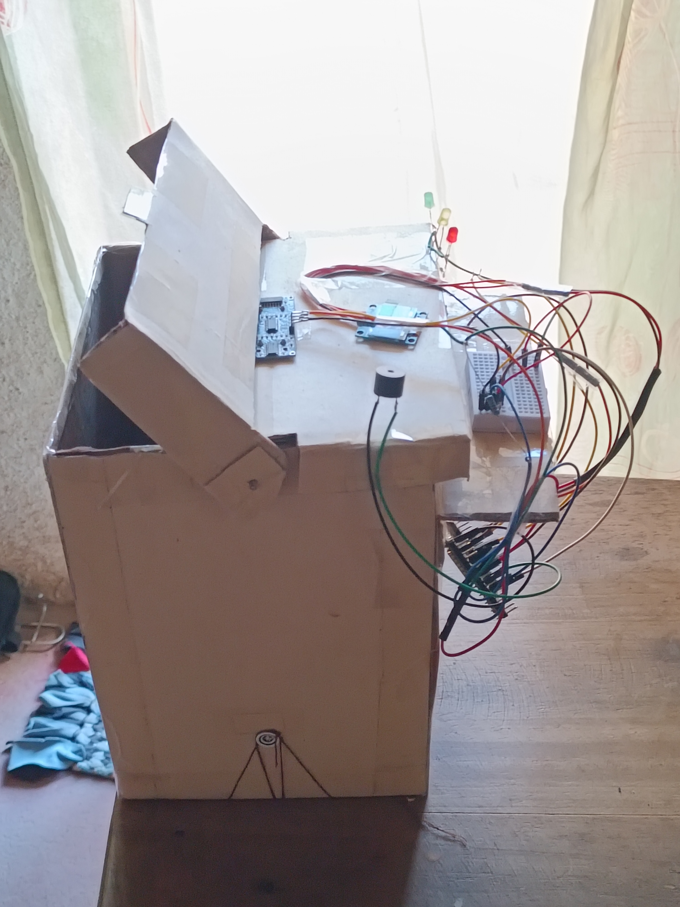
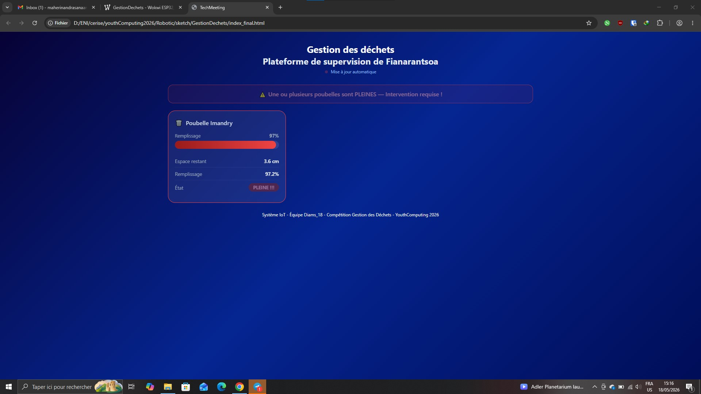

# 🗑️ FullBin : Smart IoT Waste Management System

## 📌 Project Overview
Developed as part of a robotics competition focused on waste management, **FullBin** is an intelligent, connected prototype designed to monitor waste accumulation in real time. 

The system utilizes an ESP32 microcontroller to measure the trash level and transmits this data dynamically to a centralized web platform. In a smart city framework, this solution empowers municipal services to optimize collection routes, prevent waste overflows, reduce operational costs, and lower the carbon footprint associated with unnecessary truck deployments.

## 🚀 Key Features & Critical Alert Systems

* **Ultrasonic Distance Measurement:** Highly reliable trash level detection using physics-based signal clamping to filter anomalies.
* **Local Alerting System:** Triple LED visual indicators, a dynamic buzzer alert, and an on-board OLED display for immediate on-site status reading.
* **Dual-Channel Remote Critical Alerts:**
  * **Telegram Bot API Integration:** Provides *instant, real-time push notifications* directly to the manager's smartphone the exact second a bin becomes full, ensuring immediate awareness and rapid deployment.
  * **SMTP Email Notifications (Gmail Client):** Acts as a *formal administrative backup log*, sending a detailed text report with automated timestamps (configured for Madagascar UTC+3) for official tracking and maintenance scheduling.
* **Cloud Integration & Scalable Web Dashboard:** Seamless real-time database updates via Firebase PATCH requests, paired with a responsive HTML5/CSS3/JavaScript interface that automatically discovers and maps new connected bins without any frontend code changes.

---

## 📸 Project Gallery

### Hardware Prototype
Below is the physical prototype of our smart waste bin:



### Web Supervision Platform
Real-time dashboard interface showing the trash level and bin status:



---

## 🛠️ Hardware Requirements & Components

To recreate or explore the physical aspect of the **FullBin** project, the following components were used:

* **Microcontroller:** ESP32 (NodeMCU Node32s)
* **Sensor:** HC-SR04 Ultrasonic Distance Sensor
* **Display:** OLED SSD1306 (128x64 pixels, I2C address `0x3C`)
* **Actuators:** 1 Active Buzzer & 3 LEDs (Green, Orange, Red)
* **Resistors:** * 3x Resistors for LED current limiting.
  * 2x Resistors configured as a **Voltage Divider** on the `ECHO` pin (converting the 5V sensor signal to an ESP32-safe 3.3V logic level).
* **Prototyping:** 1x Breadboard & Jumper wires
* **Structure:** Custom cardboard waste bin chassis (Dimensions: 15cm × 15cm × 23cm)

---

## 📁 Repository Architecture

The project is cleanly structured to separate the hardware firmware from the software layer:

```text
FullBin/
├── firmware/
│   └── sketch.ino          # Arduino/C++ source code for ESP32
├── web-interface/
│   ├── index.html          # Dashboard skeleton
│   ├── style.css           # Custom dark theme styling
│   └── script.js           # Real-time Firebase fetching logic
└── docs/
    ├── captures/           # Screenshots of the web platform
    └── photos/             # Physical prototype building step and photos
```

---

## 💻 Installation & Usage

### 1. Firmware Setup
1. Open `firmware/sketch.ino` in the **Arduino IDE**.
2. Install the required libraries (`Adafruit_SSD1306`, `ESP_Mail_Client`, `Adafruit_GFX`).
3. Update your network, Firebase, Telegram, and Email configuration variables directly in the code:

```cpp
const char* WIFI_SSID     = "YOUR_WIFI_SSID";
const char* WIFI_PASSWORD = "YOUR_WIFI_PASSWORD";

// Telegram Configuration
const char* BOT_TOKEN     = "YOUR_TELEGRAM_BOT_TOKEN";
const char* CHAT_ID       = "YOUR_TELEGRAM_CHAT_ID";

// Email Configuration
#define GMAIL_SENDER_PASSWORD "YOUR_GMAIL_APP_PASSWORD"
#define EMAIL_RECIPIENT       "manager_email@gmail.com"
```

4. Flash the code onto your ESP32 board.

### 2. Web Dashboard Setup
1. Navigate to the `web-interface/` directory.
2. Update the `FIREBASE_URL` in `script.js` with your Firebase endpoint.
3. Launch `index.html` directly in any modern web browser to view live data.

---

## 👥 Team & Collaboration

* **MAHERINANDRASANA Arotiana Brad Florentin** - *Systems & Network Student*
* **RAMAHANDRISOA Diamondra Patricia** - *Project Co-developer (Web Developer Student)*
